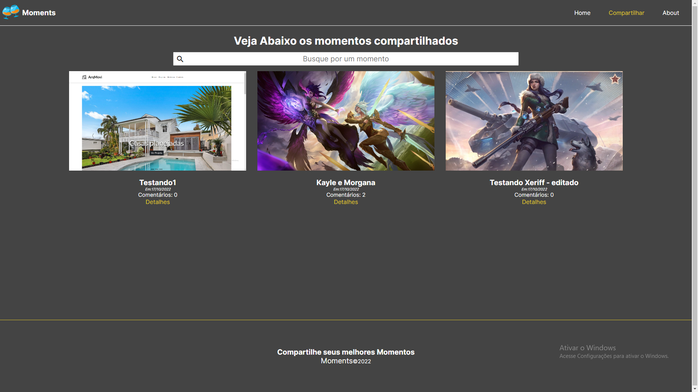
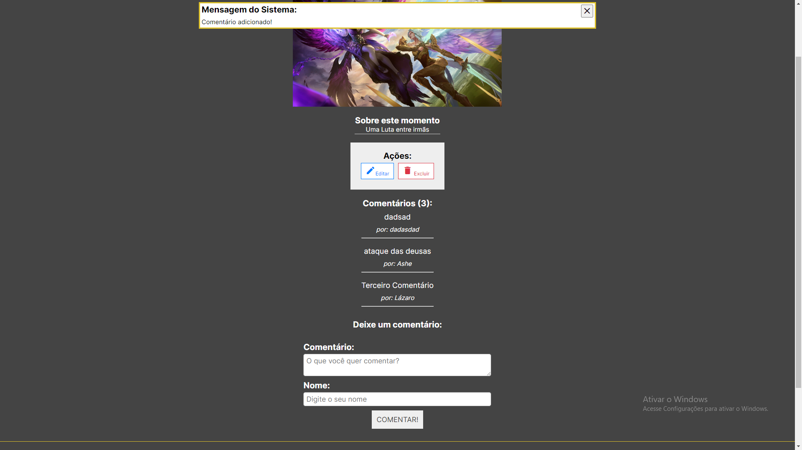
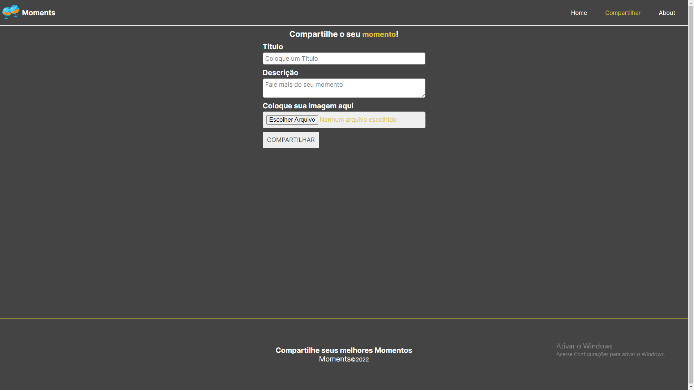

# BestMoments

Um Crud de postagem de "Melhores momentos", em que pode salvar uma foto com título e descrição, com possibilidade de editar e salvar em um bancos de dados via API. 

Desenvolvido em Angular version 14.2.6

O projeto foi dividido em componentes, possui navegação, serviços e interfaces. Foi estilizado utilizando CSS e Angular Material. 

*   Função de procura
*   Criar postagem
*   Função de editar postagem
*   Função de remover postagem
*   Função de fazer comentários em cada postagem
*   Função de mensageria


### Resultados






O projeto foi desenvolvido em Angular.js durante um curso de Angular.

### Repositório Backend

[API Adonis](https://github.com/matheusbattisti/curso_adonis_api_yt)

### Executando Localmente

### Frontend

1. Primeiro passo
```
git clone https://github.com/Drlazinho/best-moments.git
```
2. Em seguida entre no diretório usando o terminal
```
cd best-moments
```
3. Depois de selecionado o diretório digite no terminal.
```
yarn install
or 
npm install
```
4. E por último execute um dos seguintes commandos, que deve ter a mesma primeira palavra chave do comando anterior.
````
ng serve
````

### Backend

1. Primeiro passo
```
git clone https://github.com/matheusbattisti/curso_adonis_api_yt.git
```
2. Em seguida entre no diretório usando o terminal
```
cd curso_adonis_api_yt
```
3. Depois de selecionado o diretório digite no terminal.
```
yarn install
or 
npm install
```
4. Gerar um key e usar em novo arquivo copia raiz do projeto .env.example com novo nome .env, em seguida colar a nova key gerada dentro do valor da APP_KEY do arquivo .env
````
node ace generate:key
````

5. Executando o backend
````
node ace serve
````

Para aplicação funcionar corretamente na máquina é necessário iniciar primeiramente o backend